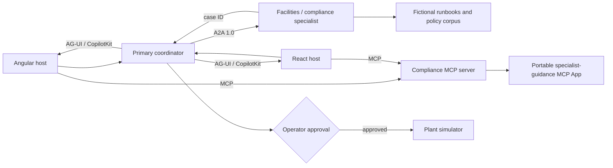

# Hands-On Agentic Frontends with AG-UI and CopilotKit

This repository is the runnable reference system for the three-hour Packt workshop. Its default scenario follows a room air-conditioning anomaly from deterministic telemetry through a primary coordinator, an A2A facilities/compliance specialist, an MCP App, a bounded A2UI-style decision surface, and explicit human judgment about alarm escalation.

The runbooks, policies, and legal sources are fictional. The system is teaching material, not operational or legal advice.

## What is implemented

- Angular 22 and React 19 hosts using the same framework-neutral client
- a deterministic plant simulator with `running`, `at-risk`, and `isolated` states
- a primary Node coordinator with CopilotKit Runtime, Mastra tool definitions, and AG-UI events
- an A2A 1.0 facilities/compliance agent returning a stable case ID and a conditional, sourced recommendation
- MCP resources and read-only tools over the fictional runbook, policy, and legal corpus
- one portable MCP App rendered unchanged inside both host frameworks
- a bounded component-catalog decision surface rather than generated application code
- approval-gated consequential actions, idempotency, timeout/retry, audit events, and correlation IDs

## Architecture



The boundaries are deliberate:

- A2A delegates specialist work and returns `CASE-*`.
- MCP exposes resources, tools, and the specialist-owned user interface.
- A2UI constrains the primary decision UI to a trusted component catalogue.
- Human approval is required for the consequential alarm decision; the specialist does not pretend to know whether the door is open.

## Run it

Requirements: Node 24 LTS or newer and pnpm 11.

The golden path is deterministic and needs no model API key. The optional
CopilotKit chat runtime is configured with an OpenAI model; set
`OPENAI_API_KEY` only if you choose to exercise that endpoint.

```bash
pnpm install
pnpm --filter @packt-workshop/compliance-mcp-app build
pnpm --filter @packt-workshop/compliance-service dev
pnpm --filter @packt-workshop/coordinator-service dev
pnpm --filter angular-host start
pnpm --filter react-host dev
```

Default URLs:

| Service                                | URL                     |
| -------------------------------------- | ----------------------- |
| Primary coordinator, AG-UI, CopilotKit | `http://localhost:4000` |
| Compliance A2A and MCP server          | `http://localhost:4100` |
| Angular host                           | `http://localhost:4200` |
| React host                             | `http://localhost:5173` |

Build and test everything with `pnpm check`. The Angular build may need permission to run its esbuild subprocess in tightly restricted environments.

## Workshop route

Use [docs/workshop-3h.md](./docs/workshop-3h.md) as the presenter runbook. The implementation checkpoints are described in [docs/checkpoints.md](./docs/checkpoints.md), and the larger expansion backlog is in [docs/two-day-expansion.md](./docs/two-day-expansion.md).

The broader narrative and rationale remain in [packt-copilotkit-workshop-blueprint.md](./packt-copilotkit-workshop-blueprint.md).
